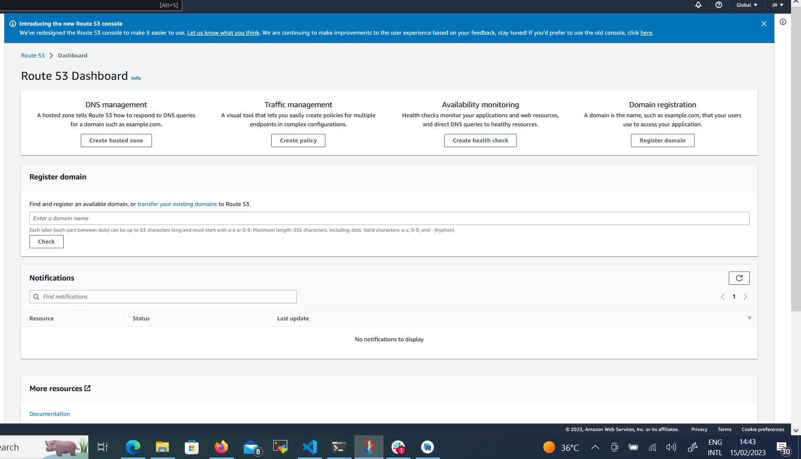
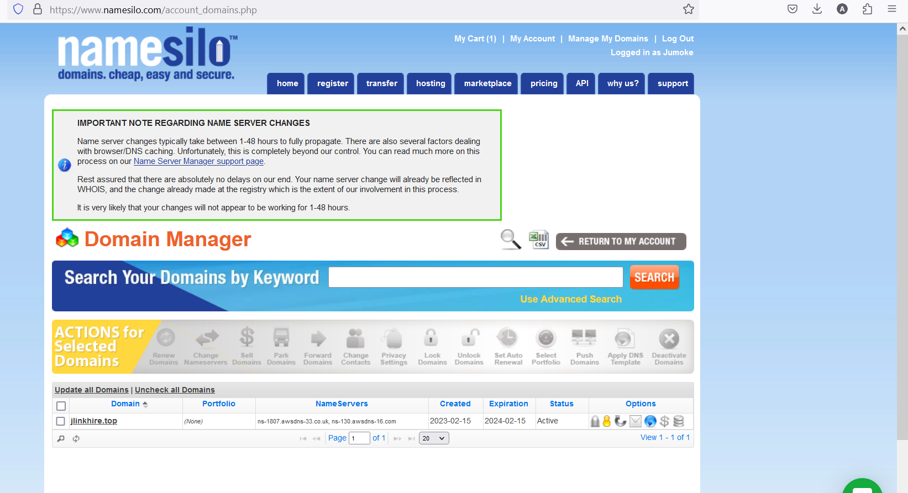

# Load Balancer Solution With Nginx and SSL/TLS

## Configure Nginx As A Load Balancer
Create an EC2 VM based on Ubuntu Server 20.04 LTS and name it Nginx LB

`ssh -i "NginxLB-Key.pem" ubuntu@ec2-18-231-84-9.sa-east-1.compute.amazonaws.com`

-Open Port TCP and HTTPS at 80 and 443 respectively

-Update /etc/hosts file for local DNS with Web Servers’ names (e.g. Web1 and Web2) and their local IP addresses

`sudo vi /etc/hosts`

Web1 172.31.5.149
Web2 172.31.1.20

-Install and configure Nginx as a load balancer to point traffic to the resolvable DNS names of the webservers

-Update the instance and Install Nginx

`sudo apt update`

`sudo apt install nginx`

-Open the default nginx configuration file

`sudo vi /etc/nginx/nginx.conf`

#insert following configuration into http section

 upstream myproject {
    server Web1 weight=5;
    server Web2 weight=5;
  }

server {
    listen 80;
    server_name www.domain.com;
    location / {
      proxy_pass http://myproject;
    }
  }

#comment out this line
#       include /etc/nginx/sites-enabled/*;

##Domain Registration-jlinkhire.top

-On AWS, Search Route 53

[]Create Hosted zone

[] Copy and Paste

[name of domain to be hosted](jlinkhire.top)

[]Click Create host

[] On Management tool on namesilo site, choose Change Nameserver
ns-1807.awsdns-33.co.uk.
ns-130.awsdns-16.com.
ns-1218.awsdns-24.org.
ns-1012.awsdns-62.net.

[]Next, Create Record on Route53

-Connect your Nginx Instance and copy the public IP address 15.228.185.101

-Create another record for www with the same IP 15.228.185.101

[] Connect Nginx instance

`ssh -i "NginxLB-Key.pem" ubuntu@ec2-15-228-185-101.sa-east-1.compute.amazonaws.com`

[]Enable nginx and start service.Make sure the service is running

`sudo systemctl enable nginx`

`sudo systemctl start nginx`

`sudo systemctl status nginx`

