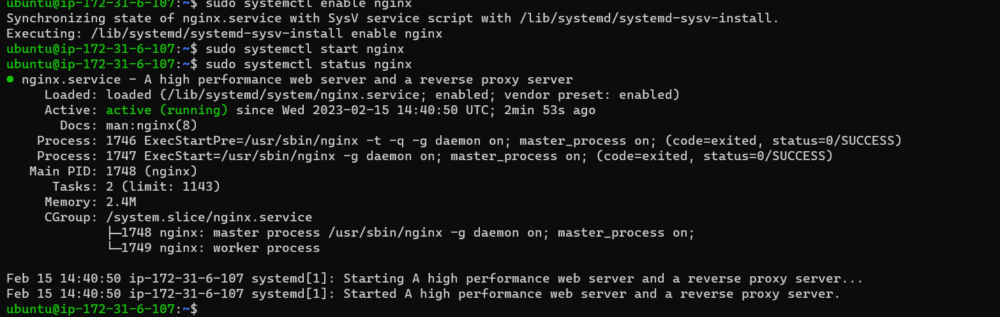

# Load Balancer Solution With Nginx and SSL/TLS

## Configure Nginx As A Load Balancer

Create an EC2 VM based on Ubuntu Server 20.04 LTS and name it Nginx LB

`ssh -i "NginxLB-Key.pem" ubuntu@ec2-18-231-84-9.sa-east-1.compute.amazonaws.com`

-Open Port TCP and HTTPS at 80 and 443 respectively

-Update /etc/hosts file for local DNS with Web Servers’ names (e.g. Web1 and Web2) and their local IP addresses

`sudo vi /etc/hosts`

Web1 172.31.5.149
Web2 172.31.1.20

-Install and configure Nginx as a load balancer to point traffic to the resolvable DNS names of the webservers

-Update the instance and Install Nginx

`sudo apt update`

`sudo apt install nginx`

-Open the default nginx configuration file

`sudo vi /etc/nginx/nginx.conf`

[] Create configuration for our reverse proxy setting

`sudo nano /etc/nginx/sites-available/load_balancer.conf`

[]insert following configuration into http section

 upstream myproject {
    server Web1 weight=5;
    server Web2 weight=5;
  }

server {
    listen 80;
    server_name www.domain.com;
    location / {
      proxy_pass http://myproject;
    }
  }

#comment out this line

[]include /etc/nginx/sites-enabled/*;

[]Domain Registration-jlinkhire.top

-On AWS, Search Route 53

[]Create Hosted zone

[] Copy and Paste

[name of domain to be hosted](jlinkhire.top)

[]Click Create host

[] On Management tool on namesilo site, choose Change Nameserver
ns-1807.awsdns-33.co.uk.
ns-130.awsdns-16.com.
ns-1218.awsdns-24.org.
ns-1012.awsdns-62.net.

[]Next, Create Record on Route53

-Connect your Nginx Instance and copy the public IP address 15.228.185.101

-Create another record for www with the same IP 15.228.185.101

[] Connect Nginx instance

`ssh -i "NginxLB-Key.pem" ubuntu@ec2-15-228-185-101.sa-east-1.compute.amazonaws.com`

[]Enable nginx and start service.Make sure the service is running

`sudo systemctl enable nginx`

`sudo systemctl start nginx`

`sudo systemctl status nginx`

[] Create configuration for our reverse proxy setting

`sudo nano /etc/nginx/sites-available/load_balancer.conf`

upstream web {
    server 172.31.5.149;
    server 172.31.1.20 ;

  }

server {
    listen 80;
    server_name jlinkhire.top www.jlinkhire.top;

    location / {
    proxy_set_header X-Forwarded-For $proxy_add_x_forwarded_for;
      proxy_pass http://web;
    }
  }

[] Ctrl O,ENter,Ctrl X

[]Run

`sudo rm -f /etc/nginx/sites-enables/default`

[] Check if Nginx is successfully configured

`sudo nginx -t`

`cd /etc/nginx/sites-enabled/`

[] Link site
`sudo ln -s ../sites-available/load_balancer.conf .`

[]check
`ls`

`ll`

[] Reload Nginx
`sudo systemctl reload nginx`

-On our domain-jlinkhire.top

5.On temrinal, install certbot
`sudo apt install certbot -y`

[]Installing a certbot for python

`sudo apt install python3-certbot-nginx -y`

[]Reload nginx
`sudo nginx -t && sudo nginx -s reload`

[] Create a certificate for domain

`sudo certbot --nginx -d jlinkhire.top -d www.jlinkhire.top`

-enter valid email address
-enter
-read service agreement

[]Make sure snapd service is active and running

`sudo systemctl status snapd`

[]Request for certificate

`sudo ln -s /snap/bin/certbot /usr/bin/certbot`

`sudo certbot --nginx`

[]Certificate confirmed

6. Setup 
`sudo certbot renew --dry-run`

[] Add the following line
* */12 * * *   root /usr/bin/certbot renew > /dev/null 2>&1

